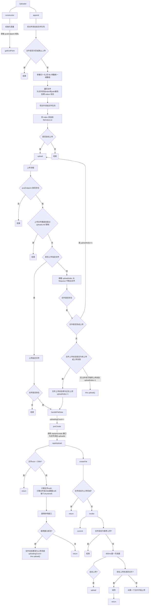

## file 对象上的参数及含义

```typescript
const FILE_STATUS_PENDING = -1; // 等待上传
const FILE_STATUS_UPLOADING = -2; // 上传中
const FILE_STATUS_ERROR = -3; // 上传失败
const FILE_STATUS_COMPLETE = -4; // 上传完成
const FILE_STATUS_PAUSING = -5; // 暂停中
{
    status: FILE_STATUS_PENDING | FILE_STATUS_UPLOADING | FILE_STATUS_ERROR | FILE_STATUS_COMPLETE | FILE_STATUS_PAUSING, // 默认为 FILE_STATUS_PENDING
    index: number, // 文件在 filequeue 队列的位置
    path: string, // 文件保存路径
    cMD5: md5, // 文件的 md5
    sMD5: md5, // 文件前 256k 的 md5
    fs_id: undefined | string, // 接口返回的 fs_id 
    uploadId:  undefined | string, // 接口返回的 uploadid
    terminate: boolean, // 是否停止上传
    uploadedSize: undefined | number,// 默认为 undefined, 文件已上传的 size
    progressInterval: number, // 对应 setInterval 的 timer,用以在文件上传完成时清除定时器, 定时器作用: 每 800ms 报一次进度, 若该文件上传完成则进行下一个文件的上传
    completeChunks: undefined | number, // 默认为 undefined, 记录文件已经上传成功的 chunk 的数量
    blockList: md5[] | []; // 默认为 [], 保存已经上传成功的 chunk 的 md5
    creating: boolean; // 默认为 false, 是否正在调用 carete 接口
    md5: string // create 接口返回的 md5 值, 暂无用途
}
```

